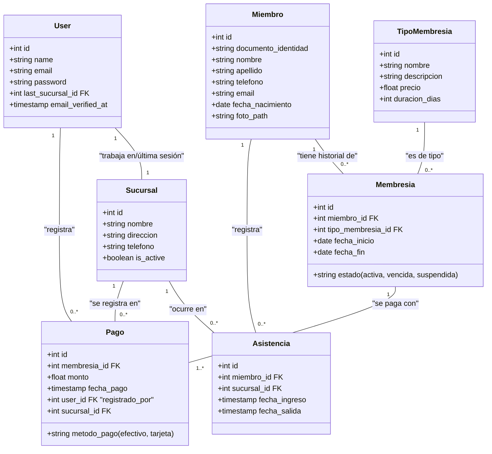

# Análisis, Sugerencias y Diseño Preliminar para GymSys

## 1. Análisis General

El documento de especificaciones es excelente, detallado y claro. Proporciona una base sólida para el desarrollo del sistema GymSys. La elección de la pila tecnológica (Laravel, Livewire, TailwindCSS) es moderna, robusta y muy adecuada para este tipo de aplicación web interactiva.

El script de inicialización del proyecto asegura una base de código consistente y la configuración de `.env` y `AppServiceProvider` son correctas para empezar.

A continuación, se presentan algunas sugerencias técnicas para mejorar la estructura, mantenibilidad y escalabilidad del proyecto, junto con un diagrama de clases preliminar.

## 2. Sugerencias de Mejora

### a. Sistema de Roles y Permisos con `spatie/laravel-permission`
Aunque Jetstream tiene una funcionalidad de "Teams" que podría adaptarse, un paquete dedicado como `spatie/laravel-permission` es más adecuado para este proyecto.
*   **Ventajas**: Ofrece una API clara y expresiva para gestionar roles (`Administrador`, `Recepcionista`) y permisos (`crear-miembro`, `editar-sucursal`, `ver-reportes-financieros`). Desacopla completamente la lógica de autorización del código de la aplicación, haciendo el sistema más seguro y fácil de mantener.
*   **Implementación**: Se instalará el paquete, se ejecutarán sus migraciones y se añadirá el trait `HasRoles` al modelo `User`.

### b. Gestión Centralizada de la Sucursal Activa
El requisito de "seleccionar sucursal al iniciar sesión" es clave para la integridad de los datos en un sistema multi-sucursal.
*   **Implementación Sugerida**:
    1.  Crear un `middleware` que se aplique a todas las rutas protegidas.
    2.  Este middleware comprobará si existe un `sucursal_id` en la sesión del usuario (`session('sucursal_id')`).
    3.  Si no existe, redirigirá al usuario a una página de selección (`/seleccionar-sucursal`).
    4.  Una vez seleccionada, el ID de la sucursal se guarda en la sesión y estará disponible globalmente, permitiendo filtrar consultas y registrar acciones (como asistencias y pagos) en la sucursal correcta.

### c. Centralización de Textos (Preparación para Futuro Multilenguaje)
Aunque el sistema será solo en español, es una buena práctica no escribir texto directamente en las vistas de Blade o componentes de Livewire.
*   **Ventaja**: Facilita la corrección de textos y la futura internacionalización.
*   **Implementación**: Utilizar los archivos de idioma de Laravel. Crear archivos en `resources/lang/es/`, por ejemplo, `messages.php`, y llamar los textos con `__('messages.welcome')` o `@lang('messages.welcome')`.

### d. Uso de Colas (Queues) para Tareas Pesadas
Las notificaciones por correo electrónico y WhatsApp implican contactar con APIs externas, lo que puede ralentizar la respuesta de la aplicación.
*   **Ventaja**: Mejora drásticamente la experiencia del usuario. La acción del usuario (ej. registrar un pago) es instantánea, y la notificación se procesa en segundo plano.
*   **Implementación**: Configurar el sistema de colas de Laravel (con la base de datos o Redis) y despachar `Jobs` para el envío de notificaciones.

### e. Variables de Entorno para Servicios Externos
Para futuras integraciones (Pagopar, WhatsApp), es crucial no dejar credenciales o API keys en el código.
*   **Implementación**: Añadir siempre las claves al archivo `.env` y leerlas a través del archivo de configuración correspondiente en `config/services.php`.
    ```dotenv
    WHATSAPP_API_TOKEN=tu_token_aqui
    PAGOPAR_API_KEY=tu_api_key_aqui
    ```

## 3. Diagrama de Clases Preliminar (Formato Mermaid)

Este diagrama muestra las tablas principales de la base de datos y sus relaciones.


*Nota: El diagrama utiliza `FK` para denotar una Clave Foránea (Foreign Key). Las relaciones como `User` con `Roles` se gestionarán a través de tablas pivote creadas por el paquete `spatie/laravel-permission`.*
