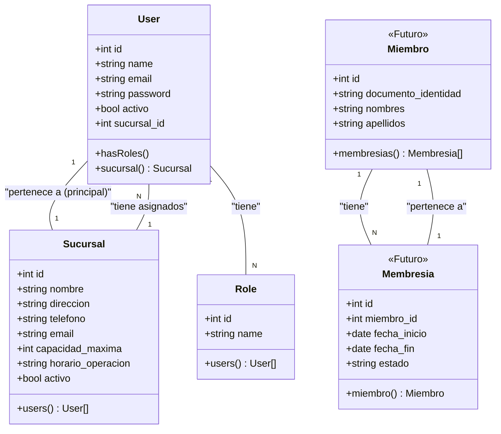

# Diagrama de Clases (Fase 1)

Este diagrama muestra las relaciones principales entre los modelos de la aplicación en esta primera fase de desarrollo. Está escrito en sintaxis de Mermaid. Puedes copiar y pegar el código en un editor de Mermaid online (como [mermaid.live](https://mermaid.live)) para visualizarlo.

### Descripción de Relaciones:

*   **User - Sucursal**: Un `User` (empleado/admin) tiene asignada una `Sucursal` principal. Una `Sucursal` puede tener muchos `Users` asignados.
*   **User - Role**: Un `User` puede tener uno o más `Roles` (ej. 'Admin', 'Recepcionista'). Un `Role` puede ser asignado a muchos `Users`. (Relación gestionada por Spatie).
*   **Miembro - Membresia (Futuro)**: Se planea que un `Miembro` (cliente del gym) pueda tener un historial de múltiples `Membresias`. Cada `Membresia` pertenece a un solo `Miembro`.
