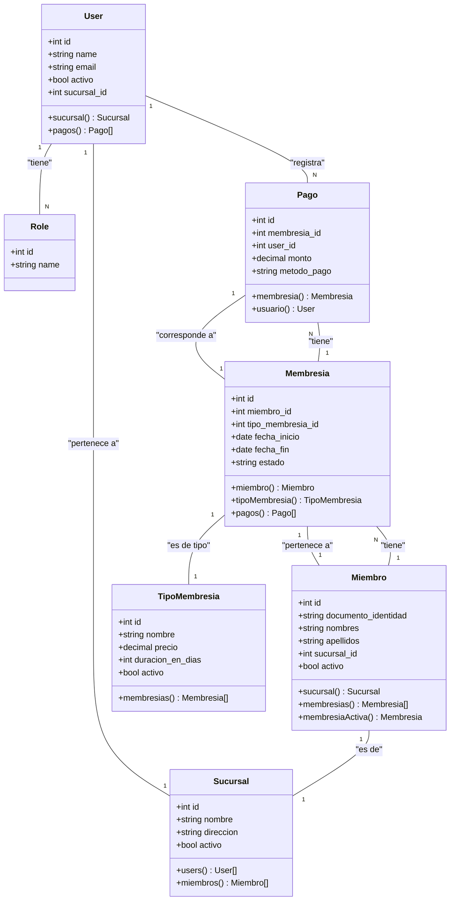

# Diagrama de Clases (Fase 2)

Este diagrama muestra las relaciones principales entre los modelos de la aplicación tras la implementación del módulo de membresías. Está escrito en sintaxis de Mermaid.

### Descripción de Relaciones:

*   Un **User** (empleado) pertenece a una **Sucursal** y puede registrar muchos **Pagos**.
*   Un **Miembro** (cliente) está registrado en una **Sucursal** principal y puede tener múltiples **Membresias** a lo largo del tiempo.
*   Una **Membresia** es de un **TipoMembresia** específico (ej. Mensual) y pertenece a un solo **Miembro**.
*   Una **Membresia** puede tener asociados uno o más **Pagos** (ej. pago inicial, cuotas).
*   Un **Pago** está siempre asociado a una **Membresia** y es registrado por un **User**.
